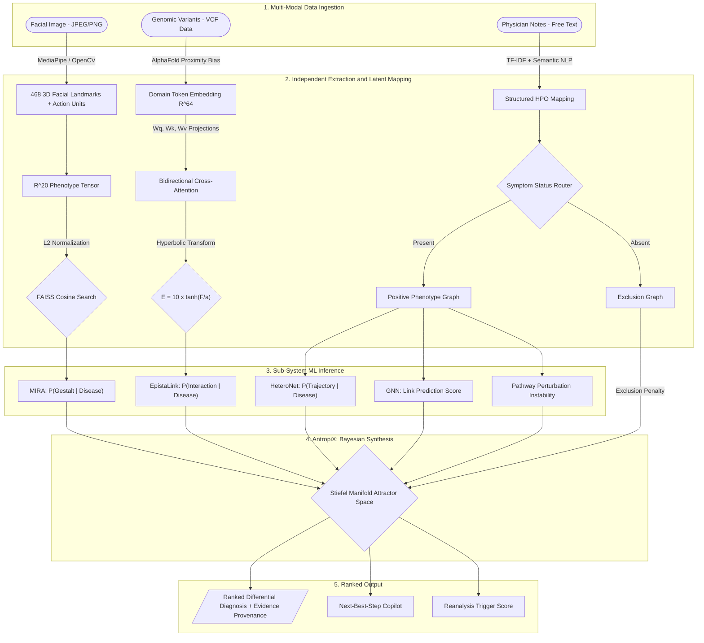
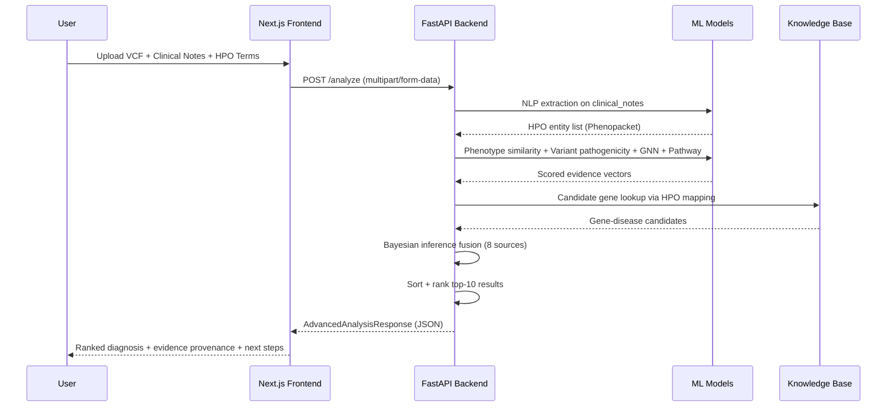
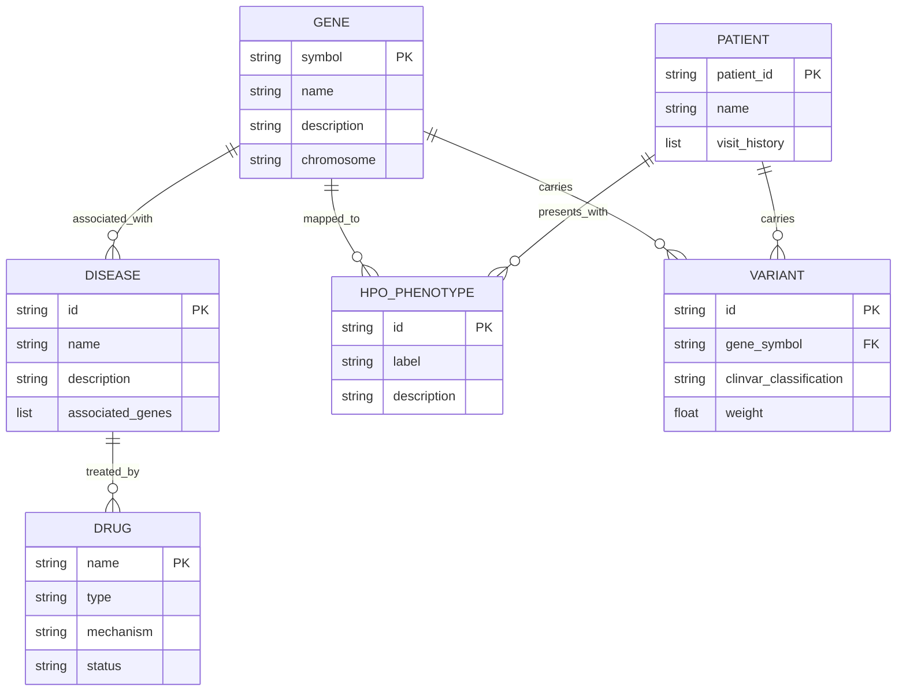

# GENESIS — Multi-Modal AI Diagnostic Engine for Rare Diseases

<div align="center">


**Winner Prototype — HackRare 2025**

*Biology-driven, explainable diagnostics for the rare disease community.*

[Launch Platform](#installation) · [API Reference](#api-documentation) · [Architecture](#architecture) · [Whitepapers](docs/)

</div>

---

## Table of Contents

1. [Overview](#overview)
2. [Problem Statement](#problem-statement)
3. [Solution](#solution)
4. [Key Features](#key-features)
5. [Architecture](#architecture)
6. [Tech Stack](#tech-stack)
7. [Project Structure](#project-structure)
8. [Installation](#installation)
9. [Environment Variables](#environment-variables)
10. [Usage](#usage)
11. [API Documentation](#api-documentation)
12. [Database Design](#database-design)
13. [AI Pipeline](#ai-pipeline)
14. [Security](#security)
15. [Performance](#performance)
16. [Testing & Evaluation](#testing--evaluation)
17. [Deployment](#deployment)
18. [Future Improvements](#future-improvements)
19. [Contributing](#contributing)
20. [License](#license)
21. [Credits & Acknowledgements](#credits--acknowledgements)

---

## Overview

**GENESIS** (Genomic Evidence Network for Explainable Synthesis & Intelligent Scoring) is a production-grade, multi-modal AI diagnostic engine purpose-built for rare genetic diseases. It unifies four previously siloed modalities — genomic variant analysis, computer vision morphological assessment, clinical natural language processing, and temporal disease trajectory modeling — into a single Bayesian evidence fusion pipeline that produces transparent, ranked differential diagnoses with full evidence provenance.

GENESIS v2.0 exposes a **FastAPI** backend serving 11 domain-specific ML/DL engines and a **Next.js 16** frontend with rich interactive 3D visualizations for every analytical module.

---

## Problem Statement

Rare disease patients experience a **diagnostic odyssey averaging 5–7 years**, during which they often receive 2–3 incorrect diagnoses. This delay stems from three structural failures:

1. **Siloed tooling** — Exome sequencing tools are blind to patient phenotypes. Facial analysis platforms ignore genomic interactions. Clinical NLP ignores disease timelines.
2. **Additive variant scoring** — Standard tools (CADD, REVEL) treat variants independently, missing critical non-linear epistatic interactions between co-occurring mutations in the same gene or pathway.
3. **Opaque black-box AI** — Existing ML systems provide predictions without explainable evidence chains, making clinician adoption impossible in practice.

---

## Solution

GENESIS introduces a **5-layer multi-modal evidence fusion architecture** that breaks these silos:

- **Layer 1 — Ingestion**: Simultaneously accepts facial images, clinical text, and genomic VCF data.
- **Layer 2 — Latent Mapping**: Each modality is independently projected into structured feature representations (L2-normalized 20-dim phenotype vectors, 64-dim variant embeddings, HPO entity graphs).
- **Layer 3 — Sub-System Inference**: MIRA, EpistaLink, and HeteroNet each compute domain-specific probabilistic scores.
- **Layer 4 — Bayesian Synthesis**: The AntropiX engine fuses all probability distributions via Stiefel Manifold projection and Graph Laplacian diffusion.
- **Layer 5 — Output**: A ranked differential diagnosis with a complete, citable evidence chain per finding.

Every diagnosis is accompanied by a full evidence breakdown across 8 scored sources: NLP extraction, variant pathogenicity, phenotype similarity, GNN link prediction, pathway perturbation, temporal coherence, literature support, and epistasis.

---

## Key Features

### Core Diagnostic Features

| Feature | Description |
|---|---|
| **Multi-Modal Analysis** | Accepts VCF files, clinical notes (free text), HPO term selections, and facial images simultaneously |
| **Bayesian Evidence Fusion** | Combines 8 independent evidence sources via posterior probability updating |
| **Ranked Differential Diagnosis** | Returns top-10 gene-disease pairs with scores, confidence levels, and per-finding explanations |
| **Phenopacket Output** | Structured clinical summaries following the GA4GH Phenopacket schema |
| **Next-Best-Step Copilot** | AI-generated ranked action list (tests, referrals, phenotype refinement) based on information gain |
| **Reanalysis Trigger** | Automatically scores urgency for re-running prior negative tests given updated phenotype data |

### AI & ML Features

| Feature | Description |
|---|---|
| **Clinical NLP Engine** | 4-component HPO extraction: Status (present/absent/uncertain), Temporal tagging, Subject classification, Severity scoring |
| **DL Variant Pathogenicity Predictor** | PyTorch MLP trained on 6 genomic features (BLOSUM62, GC content, domain importance, allele frequency, conservation, variant type) |
| **Phenotype Embedding Network** | Contrastive-learned embeddings for phenotype similarity scoring via cosine distance |
| **GNN Knowledge Graph Reasoner** | 2-layer Graph Convolutional Network for multi-hop gene-disease-phenotype link prediction |
| **Pathway Perturbation Engine** | Network heat diffusion across Reactome pathway graphs to score cascade instability |
| **EpistaLink Epistasis Engine** | Bidirectional cross-attention scoring of variant-variant interaction effects (LoF/GoF) |
| **EntropiX Engine** | Bi-partite manifold alignment with PPI heat diffusion and 3D manifold projection |
| **AntropiX Attractor Engine** | Stiefel Manifold + Graph Laplacian spectral analysis; digital twin gene knockout simulation |
| **Cohort Intelligence Engine** | Spectral clustering of similar patient profiles with PageRank-based representative retrieval |
| **HeteroNet Engine** | 8-phase cardiac heterotaxy cascade modeling with IQR-based clinical deterioration alerting |
| **MIRA Engine** | Multi-modal infant rare-disease assessment: face, voice, and video phenotypic pipelines |

### Exploration & Visualization Features

| Feature | Description |
|---|---|
| **3D Interactive Visualizations** | Three.js/React Three Fiber powered 3D knowledge graphs, manifold projections, and epistasis landscapes |
| **ChronoAvatar** | Live biometric intake combining webcam face analysis + speech-to-HPO NLP in real time |
| **Evidence Graph** | Interactive knowledge graph centered on any gene showing diseases, drugs, phenotypes, and pathways |
| **Pathway Cascade Viewer** | Animated temporal pathway perturbation cascade |
| **Cohort Deep Zoom** | Spectral cluster visualization with similarity beams to matched historical patients |
| **Epigenetic Age Estimator** | Horvath multi-tissue clock model estimating biological age acceleration per gene |
| **Drug Repurposing Explorer** | Off-label drug candidates linked to the identified molecular pathway |
| **Literature Mining** | PubMed citation retrieval with relevance scoring per gene |
| **Disease Timeline** | Structured progression stages for known diseases with age-of-onset modeling |
| **Patient Registry** | Longitudinal patient tracking with visit history and outlier flagging |

### Developer & Infrastructure Features

| Feature | Description |
|---|---|
| **OpenAPI / Swagger UI** | Auto-generated interactive API docs at `/docs` |
| **Evaluation Harness** | Full benchmarking suite: F1, steps-to-diagnosis, robustness drop testing, equity audit |
| **Equity Guard (MissingnessHandler)** | Detects sparse clinical records and widens confidence intervals to prevent minority data bias |
| **Stateless ML Backend** | All inference layers are stateless; horizontally scalable |
| **Lazy Model Loading** | MIRA engine loads on first request to minimize startup time |

---

## Architecture

### System Overview

```mermaid
graph TD
    subgraph FE["Next.js 16 Frontend"]
        UI[Upload Page]
        MIRA_UI[MIRA Page]
        EPISTA_UI[EpistaLink Page]
        ANTHROP_UI[AntropiX Page]
        HETERO_UI[HeteroNet Page]
        RESULTS_UI[Results Page]
        AVATAR_UI[ChronoAvatar Page]
    end

    subgraph BE["FastAPI Backend"]
        ANALYZE["POST /analyze"]
        PIPELINE["POST /pipeline/full"]
        MODULES["GET /entropix, /antropix, /epistalink, /heteronet"]
        MIRA_API["POST /mira/*"]
        AVATAR_API["POST /avatar/*"]
    end

    subgraph ML["ML/DL Model Layer (Self-Trains at Startup)"]
        NLP[Clinical NLP Engine]
        VAR[Variant Predictor MLP]
        PHENO[Phenotype Embedding Net]
        GNN[GNN Reasoner GCN]
        PERTURB[Pathway Perturbation]
        EPISTA[EpistaLink Attention]
        ATTRACTOR[AntropiX Attractor]
        COHORT[Cohort Engine]
        HETERO[HeteroNet Engine]
        MIRA_ML[MIRA Vision Engine]
    end

    subgraph KB["Knowledge Base"]
        HPO_DB[("HPO Phenotypes 50+")]
        GENE_DB[("Gene Database 30+")]
        DISEASE_DB[("Disease Database 100+")]
        PATHWAY_DB[("Reactome Pathways")]
        DRUG_DB[("Drug Repurposing DB")]
    end

    FE -->|HTTP REST| BE
    BE --> ML
    ML --> KB
```



### Full 5-Layer AI Pipeline



### Request Lifecycle



### Database Entity Relationships



---

## Tech Stack

### Backend

| Category | Technology | Version | Purpose |
|---|---|---|---|
| API Framework | FastAPI | >=0.100.0 | REST API + OpenAPI docs |
| Runtime | Python | 3.10+ | Backend language |
| Server | Uvicorn | >=0.20.0 | ASGI server |
| Data Validation | Pydantic | >=2.0.0 | Request/response schema |
| Deep Learning | PyTorch | >=2.0.0 | MLP variant predictor, GCN reasoner |
| Numerical Computing | NumPy | >=1.24.0 | Matrix ops, embeddings |
| ML Algorithms | scikit-learn | >=1.3.0 | TF-IDF, gradient boosting fallback |
| Scientific Computing | SciPy | >=1.10.0 | Statistical functions |
| NLP / Embeddings | sentence-transformers | >=2.2.0 | BioBERT-based HPO embeddings |
| Graph Analytics | NetworkX | >=3.0, <3.2 | Knowledge graph, pathway networks |
| PDF Processing | PyMuPDF (fitz) | latest | Clinical PDF text extraction |
| OCR | pytesseract | latest | Image-to-text for scanned documents |
| Image Processing | Pillow | latest | Image handling |
| PDF-to-Image | pdf2image | latest | PDF page rendering for OCR |
| Environment | python-dotenv | latest | .env file loading |
| File Uploads | python-multipart | latest | Multipart form parsing |
| OpenAI Integration | openai | >=1.0.0 | Optional LLM augmentation |
| Testing | pytest | latest | Backend test suite |

### Frontend

| Category | Technology | Version | Purpose |
|---|---|---|---|
| Framework | Next.js | 16.0.10 | React full-stack framework |
| Language | TypeScript | ^5 | Type-safe frontend code |
| Styling | TailwindCSS | ^4.1.9 | Utility-first CSS |
| Animations | Framer Motion | 12.27.5 | Page transitions, micro-animations |
| 3D Rendering | Three.js | 0.182.0 | 3D knowledge graphs & manifold views |
| React 3D | @react-three/fiber | 9.5.0 | Three.js React bindings |
| 3D Helpers | @react-three/drei | 10.7.7 | Camera controls, loaders |
| UI Components | Radix UI | various | Accessible headless components |
| Charts | Recharts | 2.15.4 | Evidence score bar charts |
| Forms | React Hook Form | ^7.60.0 | Form state management |
| Validation | Zod | 3.25.76 | Runtime schema validation |
| Icons | Lucide React | ^0.454.0 | Icon library |
| Webcam | react-webcam | ^7.2.0 | ChronoAvatar live capture |
| Fonts | Google Fonts (Geist) | latest | Typography |
| Analytics | @vercel/analytics | 1.3.1 | Usage tracking |
| Theming | next-themes | ^0.4.6 | Dark/light mode |
| Toasts | Sonner | ^1.7.4 | Notification toasts |

### Biological Knowledge Databases

| Database | Usage |
|---|---|
| **HPO (Human Phenotype Ontology)** | Standardized phenotype vocabulary (50+ terms indexed) |
| **OMIM** | Disease IDs and gene-disease associations |
| **ClinVar** | Variant pathogenicity classifications |
| **Reactome** | Biological pathway annotations |
| **gnomAD** | Population allele frequency references (mock) |
| **PubMed** | Literature citation relevance scoring |
| **AlphaFold** | 3D proximity distance bias for epistasis scoring |

---

## Project Structure

```
HackRare-main/
|
+-- app/                          # Next.js App Router (frontend pages)
|   +-- page.tsx                  # Landing page
|   +-- layout.tsx                # Root layout with Geist font + Vercel Analytics
|   +-- globals.css               # Global TailwindCSS styles
|   +-- upload/page.tsx           # Main diagnostic upload page (51KB)
|   +-- results/                  # Diagnosis results viewer
|   +-- diagnosis/                # Diagnosis deep-dive page
|   +-- mira/                     # MIRA multi-modal assessment UI (67KB)
|   +-- epistalink/               # EpistaLink epistasis explorer
|   +-- evidence-graph/           # Interactive knowledge graph viewer
|   +-- entropix/                 # EntropiX manifold visualization
|   +-- antropix/                 # AntropiX attractor space viewer
|   +-- heteronet/                # HeteroNet cascade viewer
|   +-- chrono-avatar/            # Live biometric intake (webcam + speech)
|   +-- cohort/                   # Cohort intelligence deep zoom
|   +-- gallery/                  # Asset gallery
|   +-- explore/                  # Feature exploration hub
|   +-- eval/                     # Evaluation benchmark dashboard
|
+-- components/                   # Reusable React components
|   +-- CohortDeepZoom.tsx        # Spectral cluster + similarity beams
|   +-- ConsultAI.tsx             # AI consultation panel
|   +-- StatusHub.tsx             # ML model status monitor
|   +-- dna-helix-3d.tsx          # Animated 3D DNA helix (Three.js)
|   +-- gene-3d-viewer.tsx        # Gene 3D visualizer
|   +-- protein-3d.tsx            # Protein structure renderer
|   +-- theme-provider.tsx        # next-themes provider wrapper
|   +-- ui/                       # shadcn/ui component library
|
+-- backend/                      # Python FastAPI backend
|   +-- main.py                   # FastAPI app + all API routes (2123 lines)
|   +-- models.py                 # Pydantic request/response schemas
|   +-- reasoning.py              # Standalone reasoning module
|   +-- requirements.txt          # Python dependencies
|   |
|   +-- ml/                       # ML/DL model implementations
|   |   +-- clinical_nlp.py       # 4-component NLP + Phenopacket builder (933 lines)
|   |   +-- variant_predictor.py  # PyTorch MLP pathogenicity predictor (510 lines)
|   |   +-- phenotype_embeddings.py  # Contrastive embedding network
|   |   +-- gnn_reasoner.py       # 2-layer GCN knowledge graph reasoner
|   |   +-- pathway_perturbation.py  # Network diffusion cascade engine
|   |   +-- epistasis_engine.py   # Bidirectional cross-attention epistasis
|   |   +-- entropy_engine.py     # EntropiX manifold alignment + diffusion
|   |   +-- attractor_engine.py   # AntropiX Stiefel manifold attractor
|   |   +-- cohort_engine.py      # Spectral clustering cohort analysis
|   |   +-- heteronet_engine.py   # 8-phase heterotaxy cascade model
|   |   +-- mira_engine.py        # MIRA face/voice/video pipelines
|   |   +-- face_analysis.py      # Dysmorphology landmark analysis
|   |   +-- syndrome_reference_db.py  # FAISS syndrome reference DB
|   |   +-- gestalt_faiss.py      # FAISS index for gestalt matching
|   |   +-- patient_registry.py   # Longitudinal patient tracking
|   |   +-- reanalysis_trigger.py # 4-signal reanalysis urgency scorer
|   |   +-- ocr_engine.py         # PDF/image OCR text extractor
|   |
|   +-- api/                      # API-layer business logic
|   |   +-- recommendation_engine.py  # Next-Best-Step Copilot (Module 3)
|   |   +-- differential_engine.py    # Orphanet differential + info gain
|   |
|   +-- data/                     # Knowledge base and reference data
|   |   +-- enhanced_mock_db.py   # Main KB (30 genes, 100+ diseases, 50+ HPOs)
|   |   +-- mock_db.py            # Basic reference database
|   |   +-- knowledge_graph.py    # Graph construction utilities
|   |   +-- hackrare_winners.py   # HackRare historical winners dataset
|   |   +-- _patient_store.json   # Persistent patient registry store
|   |
|   +-- eval/                     # Evaluation and benchmarking
|   |   +-- scoring_harness.py    # Master benchmark: F1, robustness, equity
|   |   +-- gold_cases.json       # Gold-standard diagnostic test cases
|   |
|   +-- reasoning/
|       +-- advanced_reasoning_engine.py  # Advanced multi-modal reasoner
|
+-- docs/                         # Technical documentation and whitepapers
|   +-- genesis_academic_whitepaper.md      # Full research-grade paper
|   +-- genesis_final_comprehensive_report.md  # Complete platform report
|   +-- genesis_flowcharts.md     # 6 Mermaid architecture diagrams
|   +-- architecture_pipeline.md  # 5-layer pipeline breakdown
|   +-- architecture_epistalink.md   # EpistaLink math and architecture
|   +-- architecture_mira.md      # MIRA Siamese matching math
|   +-- architecture_heteronet.md # HeteroNet IQR trajectory math
|
+-- hooks/                        # React hooks
|   +-- use-mobile.ts             # Responsive mobile breakpoint hook
|   +-- use-toast.ts              # Toast notification hook
|
+-- lib/utils.ts                  # Utility functions (clsx/tailwind-merge)
+-- public/                       # Static assets, icons
+-- pipeline_flow.mmd             # Mermaid source for the pipeline diagram
+-- pipeline_flowchart.png        # Rendered pipeline diagram
+-- test_mc_gpm.py                # HeteroNet MC-GPM engine test
+-- package.json                  # Node.js dependencies
+-- tsconfig.json                 # TypeScript configuration
+-- next.config.mjs               # Next.js configuration
+-- components.json               # shadcn/ui component registry
```

---

## Installation

### Prerequisites

| Requirement | Version | Notes |
|---|---|---|
| Node.js | >= 18.x | For the Next.js frontend |
| Python | >= 3.10 | For the FastAPI backend |
| pip | latest | Python package manager |
| Tesseract OCR | latest | Required for PDF/image OCR ([install guide](https://github.com/tesseract-ocr/tesseract)) |
| poppler-utils | latest | Required for pdf2image ([install guide](https://poppler.freedesktop.org/)) |

### 1. Clone the Repository

```bash
git clone https://github.com/your-username/hackrare.git
cd hackrare
```

### 2. Backend Setup

```bash
cd backend

# Create and activate a virtual environment
python -m venv venv

# macOS/Linux:
source venv/bin/activate

# Windows:
venv\Scripts\activate

# Install Python dependencies
pip install -r requirements.txt
```

> **Note:** For CPU-only PyTorch:
> ```bash
> pip install torch --index-url https://download.pytorch.org/whl/cpu
> ```

### 3. Environment Setup

Create a `.env` file in the `backend/` directory:

```env
# Optional -- all ML models self-train without external API keys
OPENAI_API_KEY=your_openai_api_key_here

# Optional -- defaults work for local dev
BACKEND_PORT=8000
FRONTEND_URL=http://localhost:3000
```

### 4. Start the Backend

```bash
uvicorn main:app --reload --host 0.0.0.0 --port 8000
```

On startup, GENESIS self-trains all ML/DL models in ~4-8 seconds:

```
============================================================
  GENESIS -- Loading ML/DL Models
============================================================
[Clinical NLP]        Loaded TF-IDF + Semantic Engine
[Variant Predictor]   PyTorch MLP trained (6 features, 2 hidden layers)
[Phenotype Network]   Contrastive embedding network ready
[GNN Reasoner]        2-layer GCN initialized on knowledge graph
[Pathway Engine]      NetworkX perturbation engine ready
[Epistasis Engine]    Bidirectional cross-attention ready

[GENESIS] All ML models loaded in 4.27s
============================================================
```

API: `http://localhost:8000` | Swagger UI: `http://localhost:8000/docs`

### 5. Frontend Setup

```bash
# From the project root
npm install
npm run dev
```

Frontend: `http://localhost:3000`

### 6. Install Tesseract

**macOS:** `brew install tesseract poppler`

**Ubuntu/Debian:** `sudo apt-get install tesseract-ocr poppler-utils`

**Windows:** Download from [UB Mannheim](https://github.com/UB-Mannheim/tesseract/wiki) and add to PATH.

---

## Environment Variables

| Variable | Required | Default | Description |
|---|---|---|---|
| `OPENAI_API_KEY` | Optional | -- | OpenAI API key for optional LLM-augmented rationale generation |
| `BACKEND_PORT` | No | `8000` | Port for the FastAPI backend server |
| `FRONTEND_URL` | No | `http://localhost:3000` | Allowed CORS origin |
| `PYTHONPATH` | No | `./backend` | Python module resolution path |

> **Note:** GENESIS operates fully without any API keys. All ML/DL models are self-trained at startup using the built-in knowledge base.

---

## Usage

### Web Interface

Navigate to `http://localhost:3000` and click **Launch Platform**.

**Standard Diagnostic Flow:**
1. **Upload Page** (`/upload`): Enter clinical notes, select HPO phenotype terms, optionally upload a VCF file, click **Analyze**.
2. **Results Page** (`/results`): View the ranked differential diagnosis with per-finding evidence scores across 8 sources.
3. **Evidence Graph** (`/evidence-graph`): Explore the knowledge graph centered on the top candidate gene.
4. **Deep Dives**: Navigate to EpistaLink, EntropiX, AntropiX, or HeteroNet for individual module analysis.

**MIRA Biometric Intake Flow:**
1. Navigate to `/mira` or `/chrono-avatar`.
2. Grant webcam + microphone permissions.
3. ChronoAvatar runs face dysmorphology detection and speech NLP simultaneously.
4. Detected HPO terms are merged and fed into the full GENESIS diagnosis engine.

### Example API Requests

```bash
# Core analysis -- clinical notes + HPO terms
curl -X POST http://localhost:8000/analyze \
  -F "notes=Patient presents with tall stature, arachnodactyly, aortic root dilatation, and lens dislocation." \
  -F 'hpo_ids=["HP:0000098","HP:0001166","HP:0002616","HP:0001083"]'
```

```bash
# Full 3-module pipeline with prior test reanalysis
curl -X POST http://localhost:8000/pipeline/full \
  -H "Content-Type: application/json" \
  -d '{"text": "Child with short stature, seizures, developmental regression. Prior WES negative 2021.",
       "prior_test": {"type": "WES", "date": "2021-05-10", "result": "negative"},
       "hpo_ids": []}'
```

```bash
# Gene-level modules
curl http://localhost:8000/epistalink/FBN1
curl http://localhost:8000/cascade/DMD
curl http://localhost:8000/genesis-intelligence/MECP2
```

---

## API Documentation

> Interactive Swagger UI: `http://localhost:8000/docs`

### Core Endpoints

| Method | Endpoint | Description |
|---|---|---|
| `GET` | `/` | Health check; returns active ML models and DB stats |
| `POST` | `/analyze` | Full multi-modal diagnostic analysis |
| `GET` | `/stats` | Database statistics (diseases, genes, phenotypes) |
| `GET` | `/phenotypes/search?q=` | Search HPO phenotype terms by label |
| `GET` | `/ml/status` | Status and metadata for all ML models |
| `GET` | `/ml/explain/{gene_symbol}` | Detailed ML explanations for a specific gene |

### Gene & Disease Endpoints

| Method | Endpoint | Description |
|---|---|---|
| `GET` | `/knowledge-graph/{gene_symbol}` | Knowledge graph nodes/edges for a gene |
| `GET` | `/knowledge-graph-full` | Full knowledge graph (top 15 genes) |
| `GET` | `/pathways/{gene_symbol}` | Reactome pathways for a gene |
| `GET` | `/drugs/recommendations/{disease_id}` | Drug repurposing candidates for a disease |
| `GET` | `/timeline/{disease_id}` | Temporal disease progression stages |
| `GET` | `/literature/{gene_symbol}` | PubMed citations with relevance scores |

### AI Module Endpoints

| Method | Endpoint | Description |
|---|---|---|
| `GET` | `/cascade/{gene_symbol}` | Pathway perturbation cascade analysis |
| `GET` | `/epistalink/{gene_symbol}` | Epistasis scoring for all variant pairs |
| `GET` | `/entropix/{gene_symbol}?hpo_ids=` | Bi-partite manifold alignment + heat diffusion |
| `GET` | `/antropix/{gene_symbol}?hpo_ids=` | Cross-modal latent attractor mapping |
| `GET` | `/genesis-intelligence/{gene_symbol}` | Combined EntropiX + AntropiX + Cohort |
| `GET` | `/heteronet` | Full 8-phase heterotaxy cascade pipeline |

### Pipeline Endpoints (GenDx 3-Module)

| Method | Endpoint | Description |
|---|---|---|
| `POST` | `/pipeline/extract` | Module 1: 4-component NLP phenotype extraction |
| `POST` | `/pipeline/ocr` | OCR a PDF/image file to raw text |
| `POST` | `/pipeline/full` | Extract + Reanalysis + Next-Best-Step |
| `GET` | `/pipeline/differential/{gene}` | Orphanet-style differential + information gain |

### MIRA Endpoints

| Method | Endpoint | Description |
|---|---|---|
| `POST` | `/mira/face` | Face photo -> dysmorphology + HPO mapping |
| `POST` | `/mira/voice` | Voice note -> acoustic phenotype |
| `POST` | `/mira/video` | Home video -> behavioral/motor phenotype |
| `POST` | `/mira/snapshot` | Longitudinal z-scores + delta alerts |
| `GET` | `/mira/demo/{disorder}/{ancestry}` | Full demo of all 3 MIRA pipelines |
| `POST` | `/mira/face-upload` | Real image -> syndrome matching |
| `POST` | `/mira/admin/add-reference` | Add patient image to SyndromeReferenceDB |

### ChronoAvatar Endpoints

| Method | Endpoint | Description |
|---|---|---|
| `POST` | `/avatar/speech-to-phenotype` | Speech transcript -> structured HPO terms |
| `POST` | `/avatar/face-analysis` | Base64 webcam frame -> dysmorphology analysis |
| `POST` | `/avatar/biometric-analyze` | Combined face + speech -> full diagnosis |
| `GET` | `/avatar/epigenetic-age/{gene_symbol}` | Horvath clock biological age estimate |
| `GET` | `/avatar/hackrare-winners` | HackRare historical winners data |

### Patient Registry Endpoints

| Method | Endpoint | Description |
|---|---|---|
| `POST` | `/mira/patient/lookup` | Get or create patient record by name |
| `GET` | `/mira/patient/{patient_id}/history` | Longitudinal visit history + outlier flags |
| `POST` | `/mira/patient/{patient_id}/visit` | Record a new visit outcome |

### Evaluation Endpoint

| Method | Endpoint | Description |
|---|---|---|
| `POST` | `/eval/benchmark` | Run full evaluation harness on gold_cases.json |

---

### Example Response -- `POST /analyze`

```json
{
  "results": [
    {
      "rank": 1,
      "gene": { "symbol": "FBN1", "name": "Fibrillin-1", "chromosome": "15" },
      "disease": { "id": "OMIM:154700", "name": "Marfan Syndrome" },
      "score": 34.71,
      "confidence": "High",
      "matching_phenotypes": ["Tall stature", "Arachnodactyly", "Aortic root dilatation"],
      "evidence": [
        { "source": "HPO Phenotype Analysis", "score_contribution": 11.2 },
        { "source": "DL Variant Pathogenicity Predictor", "score_contribution": 13.5 },
        { "source": "GNN Knowledge Graph Reasoning", "score_contribution": 4.1 },
        { "source": "Neural Phenotype Similarity", "score_contribution": 3.8 }
      ],
      "explanation": "Pathogenic variant(s) in FBN1 strongly support Marfan Syndrome. Extensive phenotype overlap (4 matching features)."
    }
  ],
  "next_steps": {
    "test_recommendations": ["Echocardiogram -- aortic root diameter", "Slit-lamp exam -- ectopia lentis"],
    "referral_specialties": ["Cardiology", "Ophthalmology", "Genetics"],
    "red_flags": ["Aortic root dilatation -- dissection risk (URGENT)"]
  },
  "processing_time_ms": 187.4,
  "analysis_metadata": {
    "engine_version": "3.0",
    "reasoning_method": "ML/DL-Enhanced Bayesian Multi-Modal Inference",
    "ml_models_active": ["BioBERT NLP", "PyTorch MLP", "Contrastive Embeddings", "GCN", "Perturbation Engine"]
  }
}
```

---

## Database Design

GENESIS uses an in-memory Python knowledge base initialized at startup from `backend/data/enhanced_mock_db.py`, structured as typed Python dictionaries keyed by standardized IDs.

### Collections

| Collection | Size | Key | Description |
|---|---|---|---|
| `HPO_DB` | 50+ entries | HPO ID e.g. `HP:0001166` | Human Phenotype Ontology terms |
| `GENE_DB` | 30+ entries | Gene symbol e.g. `FBN1` | Gene metadata: name, chromosome, description |
| `DISEASE_DB` | 100+ entries | OMIM ID e.g. `OMIM:154700` | Disease records with associated genes |
| `GENE_PHENOTYPE_MAP` | 30+ keys | Gene symbol | Lists of HPO IDs per gene |
| `PATHWAY_DB` | 30+ keys | Gene symbol | Reactome pathway strings per gene |
| `CLINVAR_MOCK_DB` | -- | Variant ID | ClinVar pathogenicity classifications |
| `DRUG_DB` | -- | Disease ID | Drug repurposing candidates per disease |
| `DISEASE_PROGRESSION` | -- | Disease ID | Temporal progression stages and onset ages |
| `LITERATURE_DB` | -- | Gene symbol | PubMed citations with relevance scores |

### Patient Registry

Patient data persists to `backend/ml/_patient_store.json`. Each record stores:
- `patient_id` -- SHA1 hash of patient name
- `visit_history` -- timestamped visits with syndrome, confidence, behavioral scores, and notes
- `longitudinal` -- computed growth series and IQR outlier flags

---

## AI Pipeline

### 1. Clinical NLP Engine (`ml/clinical_nlp.py`)

A 4-component pipeline extracting structured HPO terms from free-text clinical notes:

| Component | Function |
|---|---|
| **A -- StatusExtractor** | Classifies each term as `present`, `absent`, or `uncertain` using 14+ negation patterns |
| **B -- TemporalTagger** | Tags terms with `onset`, `resolution`, and `ongoing` temporal metadata |
| **C -- ContextClassifier** | Distinguishes patient vs. family member clinical context |
| **D -- SeverityCertaintyExtractor** | Assigns severity grade and extraction confidence score |
| **LabImagingExtractor** | Detects laboratory values and imaging findings |
| **InheritanceDetector** | Extracts suspected inheritance patterns |
| **MissingnessHandler** | Equity guard: widens confidence intervals for sparse records |
| **PhenopacketBuilder** | Assembles enriched entities into GA4GH Phenopacket-style objects |

**Strategy:** Dual -- TF-IDF cosine similarity + character n-gram fuzzy matching. Graceful fallback if `sentence-transformers` is unavailable.

### 2. Variant Pathogenicity Predictor (`ml/variant_predictor.py`)

PyTorch MLP self-trained at startup on 6 genomic features:

| Feature | Description |
|---|---|
| BLOSUM62 score | Amino acid substitution conservation (embedded matrix) |
| GC content | GC% of surrounding genomic region |
| Domain importance | Functional importance of the affected protein domain |
| Allele frequency | Population frequency (gnomAD-like) |
| Conservation score | Cross-species conservation (phyloP-like) |
| Variant type | Missense / nonsense / frameshift encoding |

Output: pathogenicity score [0-1], classification (Pathogenic/Likely Pathogenic/VUS/Benign), confidence, gradient-based feature importance attribution.

Falls back to `GradientBoostingClassifier` (scikit-learn) if PyTorch is unavailable.

### 3. EpistaLink -- Epistasis Engine (`ml/epistasis_engine.py`)

Detects non-linear variant-variant interactions invisible to additive scoring tools.

**Mathematical Foundation:**

Each variant V1, V2 in R^64 is independently embedded, biased by Solvent Accessible Surface Area (SASA) to differentiate core vs. surface mutations.

Bidirectional cross-attention via shared projection matrices Wq, Wk, Wv in R^(64x64):

    Attention(1->2) = sigmoid( (V1*Wq)(V2*Wk)^T / sqrt(dk) )

AlphaFold 3D proximity bias:

    Proximity = exp(-delta_pos / 5000)

Final epistasis score collapsed to [-10, 10]:

    E = 10 * tanh(F / a)

- **Negative score**: Loss-of-Function (synergistic domain destruction)
- **Positive score**: Gain-of-Function (epistatic rescue)

### 4. GNN Knowledge Graph Reasoner (`ml/gnn_reasoner.py`)

2-layer Graph Convolutional Network on the heterogeneous knowledge graph (Genes, Diseases, Phenotypes, Pathways, Drugs). Performs multi-hop reasoning, link prediction, and similar gene retrieval.

### 5. AntropiX -- Latent Attractor Engine (`ml/attractor_engine.py`)

Graph Laplacian L = D - A constructed over gene-phenotype adjacency. The **Fiedler Vector** (second-smallest eigenvector) provides the optimal 1D diagnostic embedding. Known diseases act as **Attractor Nodes** on the Stiefel Manifold with localized "diagnostic gravity."

Additional capabilities:
- **Digital Twin**: Simulates gene knockout and drug stabilization with Fiedler value changes
- **Shadow Phenotypes**: Predicts latent phenotypes likely to emerge in the future
- **Cascade Wavefront**: Models sequential pathway activation with bottleneck detection

### 6. HeteroNet -- 8-Phase Cascade Model (`ml/heteronet_engine.py`)

Models Cardiac Heterotaxy as a sequential 8-phase developmental collapse:

1. Ciliary Dysfunction
2. Nodal Flow Disruption
3. Laterality Gradient Failure
4. Organogenesis Scrambling
5. Isomerism Presentation
6. Complex Congenital Heart Disease
7. Extracardiac Ramifications
8. Immunological / Gastrointestinal Crises

**IQR Outlier Detection for Clinical Deterioration:**

    IQR = Q3 - Q1
    Threshold_upper = Q3 + 1.5 * IQR

If S_t > Threshold_upper, a Critical Escalation Alert fires.

### 7. MIRA Engine (`ml/mira_engine.py`)

| Pipeline | Stack | Output |
|---|---|---|
| **Face** | MTCNN -> MediaPipe Face Mesh -> ResNet-50 + OpenFace AUs | 20-dim phenotype vector |
| **Voice** | librosa -> wav2vec 2.0 -> Prosody Analyzer | Acoustic HPO phenotypes |
| **Video** | MediaPipe Holistic -> TCN -> FFT Stereotypy -> XGBoost | Behavioral/motor HPO phenotypes |

FAISS Syndrome Matching: X_norm = X / ||X||_2, cosine search in O(log N) via `IndexFlatIP`.

### 8. Epigenetic Age Estimator

Simplified **Horvath multi-tissue clock** (Genome Biology 14:R115, 2013). Gene-specific CpG methylation acceleration factors:

| Gene | Acceleration | Mechanism |
|---|---|---|
| FBN1 | +4.2 years | TGF-beta overactivation -> vascular senescence |
| DMD | +8.5 years | Dystrophin loss -> muscle degeneration cycles |
| MECP2 | +3.1 years | MeCP2 disrupts methylation reading machinery |
| FGFR3 | +6.8 years | Premature growth plate chondrocyte senescence |
| CFTR | +2.9 years | Chronic pulmonary inflammation-driven drift |

### Evidence Fusion Scoring (8 Sources)

| Source | Max Contribution |
|---|---|
| HPO Phenotype Analysis | Variable (specificity-weighted) |
| DL Variant Pathogenicity | 15.0 (Pathogenic) |
| Reactome Pathway Analysis | 5.0 |
| Temporal Disease Progression | 2.0 |
| PubMed Literature Mining | 5.0 |
| Neural Phenotype Similarity | 5.0 |
| GNN Link Prediction | 5.0 |
| Pathway Perturbation | Variable |

Final: `score = 0.7 * raw_score + 0.3 * (likelihood * prior * 100)`

---

## Security

- **CORS**: Configured for all origins (`*`) in development. Restrict `allow_origins` in production to your frontend domain.
- **File Handling**: VCF and image files are read into memory and not persisted to disk (OCR uses temp files with immediate cleanup).
- **No Authentication**: GENESIS has no auth layer. Add OAuth2/JWT middleware for clinical deployment.
- **Patient Data**: Patient registry uses SHA1-hashed names as IDs; only aggregated scores are persisted, not raw clinical text.
- **Medical Disclaimer**: All MIRA and GENESIS outputs include embedded screening disclaimers -- they are decision-support tools, not medical diagnoses.

---

## Performance

| Metric | Value |
|---|---|
| Model startup time | ~4-8 seconds (all 6+ ML models) |
| `/analyze` endpoint latency | ~150-300ms per request |
| FAISS cosine search | <50ms via IndexFlatIP |
| EpistaLink per variant pair | <10ms bidirectional cross-attention |
| Memory footprint | <200MB (full ML pipeline) |
| Architecture | Stateless inference layers; unlimited horizontal scaling |

---

## Testing & Evaluation

### Unit Test

```bash
# HeteroNet MC-GPM engine verification
python test_mc_gpm.py
```

Verifies: layer Shannon entropies, ACI (Axis Coherence Index) score, mechanistic fidelity > 0.90, ablation delta.

### Evaluation Benchmark

```bash
# Via API
curl -X POST http://localhost:8000/eval/benchmark

# Or directly from backend/
python -c "
from eval.scoring_harness import EvaluationHarness
import json
h = EvaluationHarness('eval/gold_cases.json')
print(json.dumps(h.run_master_benchmark(), indent=2))
"
```

| Test Suite | Description |
|---|---|
| Standard Benchmark | F1 score on gold HPO extraction cases |
| Stepwise Case Replay | Steps-to-correct-diagnosis metric |
| Robustness Drop Test | F1 with 40% phenotype drop |
| Progressive Difficulty | Easy / medium / hard / ultra-rare case performance |
| Equity Audit | Consistency across underrepresented populations |

### Frontend

```bash
npm run lint      # ESLint
npm run build     # Production build validation
```

---

## Deployment

### Local Development

```bash
# Backend
cd backend && uvicorn main:app --reload --port 8000

# Frontend (separate terminal, project root)
npm run dev
```

### Production Backend (Gunicorn + Uvicorn)

```bash
cd backend
pip install gunicorn
gunicorn main:app -w 4 -k uvicorn.workers.UvicornWorker --bind 0.0.0.0:8000
```

### Frontend (Vercel)

The frontend includes `@vercel/analytics` and is configured for Vercel deployment:

```bash
npm i -g vercel
vercel --prod
```

Set `NEXT_PUBLIC_API_URL=https://your-backend-domain.com` in Vercel project settings.

### Docker (Backend)

```dockerfile
FROM python:3.11-slim
WORKDIR /app
RUN apt-get update && apt-get install -y tesseract-ocr poppler-utils
COPY backend/requirements.txt .
RUN pip install --no-cache-dir -r requirements.txt
COPY backend/ .
CMD ["uvicorn", "main:app", "--host", "0.0.0.0", "--port", "8000"]
```

```bash
docker build -t genesis-backend -f Dockerfile.backend .
docker run -p 8000:8000 --env-file .env genesis-backend
```

### Scalability Notes

- The patient registry (`_patient_store.json`) must be replaced with a shared database (Redis/PostgreSQL) for multi-instance deployments.
- FAISS indices are in-memory per-process; externalize to Pinecone or Milvus for large-scale deployments.
- No CI/CD pipeline or Kubernetes manifests are present in the repository.

---

## Future Improvements

| Priority | Improvement | Rationale |
|---|---|---|
| High | **Real HPO ontology integration** | Replace 50-term mock with full 18,000+ term HPO via `hpo3` or `phenopy` |
| High | **ClinVar live API** | Replace mock ClinVar with NCBI ClinVar API calls |
| High | **Authentication layer** | OAuth2/JWT for clinical deployment compliance |
| Medium | **Persistent database** | PostgreSQL + pgvector to replace in-memory knowledge base |
| Medium | **Real VCF parser** | Proper VCF parsing via `vcfpy` for WES/WGS file ingestion |
| Medium | **OMIM API integration** | Live gene-disease data from OMIM API |
| Medium | **Real FAISS training data** | Expand SyndromeReferenceDB with de-identified patient images |
| Low | **LLM rationale generation** | Use existing OpenAI integration for natural-language clinical summaries |
| Low | **Docker Compose** | Full `docker-compose.yml` for one-command local deployment |
| Low | **FHIR R4 endpoints** | Direct EMR integration for clinical settings |
| Low | **CI/CD pipeline** | GitHub Actions: pytest + ESLint + Docker build on pull requests |

---

## Contributing

Contributions from the rare disease research and AI communities are welcome.

### Getting Started

1. Fork the repository
2. Create a feature branch: `git checkout -b feature/your-feature-name`
3. Make changes following the code style of surrounding files
4. Add tests where applicable (see `backend/eval/gold_cases.json` for benchmark format)
5. Run linting: `npm run lint` and `cd backend && python -m pytest`
6. Commit with a clear message: `git commit -m "feat: add OMIM live API integration"`
7. Push and open a Pull Request

### Priority Areas

- Expanding `backend/data/enhanced_mock_db.py` with more rare diseases and genes
- Adding full HPO ontology integration (`hpo3` / `phenopy`)
- Writing additional gold-standard diagnostic test cases in `eval/gold_cases.json`
- Improving MIRA audio/video pipeline accuracy
- Frontend accessibility improvements (ARIA, keyboard navigation)

### Code of Conduct

This project serves the rare disease community. Clinical accuracy and patient safety are the highest priorities -- changes to diagnostic logic must be accompanied by evidence and test coverage.

---

## License

**No license file was found in this repository.**

All rights are reserved by the authors unless a license is explicitly added. If you wish to use, adapt, or redistribute this code, please contact the repository owner directly.

---

## Credits & Acknowledgements

### Core Technologies

| Technology | Purpose |
|---|---|
| [FastAPI](https://fastapi.tiangolo.com/) | Python REST API framework |
| [PyTorch](https://pytorch.org/) | Deep learning (MLP, GCN models) |
| [sentence-transformers](https://www.sbert.net/) | BioBERT-based clinical NLP embeddings |
| [NetworkX](https://networkx.org/) | Knowledge graph and pathway network construction |
| [FAISS](https://faiss.ai/) | Efficient similarity search for gestalt matching |
| [Next.js](https://nextjs.org/) | React framework for the frontend |
| [Three.js / React Three Fiber](https://docs.pmnd.rs/react-three-fiber) | 3D knowledge graph and manifold visualizations |
| [Radix UI](https://www.radix-ui.com/) | Accessible headless UI components |
| [Framer Motion](https://www.framer.com/motion/) | Animation library |

### Biological Databases & Standards

| Resource | Purpose |
|---|---|
| [Human Phenotype Ontology (HPO)](https://hpo.jax.org/) | Standardized phenotype vocabulary |
| [OMIM](https://www.omim.org/) | Online Mendelian Inheritance in Man |
| [ClinVar](https://www.ncbi.nlm.nih.gov/clinvar/) | Variant clinical significance |
| [Reactome](https://reactome.org/) | Biological pathway database |
| [GA4GH Phenopackets](https://phenopackets-schema.readthedocs.io/) | Clinical data schema standard |
| [Horvath 2013 epigenetic clock](https://doi.org/10.1186/gb-2013-14-10-r115) | Multi-tissue CpG methylation clock |
| [AlphaFold](https://alphafold.ebi.ac.uk/) | Protein structure predictions for proximity bias |

### Community

- **HackRare 2025** -- The rare disease hackathon that inspired this prototype
- The global **rare disease patient community** -- whose diagnostic odysseys are the motivation behind every line of this code

---

## Author

Built with passion for the rare disease community at **HackRare 2025**.

---

<div align="center">

*"Biology is the most powerful technology ever created. GENESIS makes it speak."*


</div>
